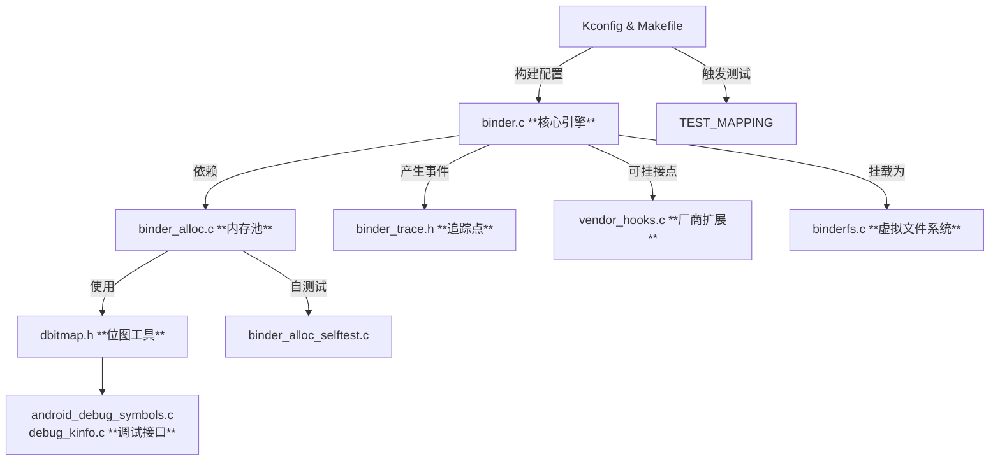

# 第二章 Binder驱动

先从驱动端讲起，先了解驱动提供了什么能力，然后在了解native层如何使用这些能力。以下都基于Android内核源码的android15-6.6分支。

### 1. 目录结构

首先，默认的aosp代码中不包含kernel代码的，所以kernel代码需要单独下载，可以从下面地址clone kernel代码：

> `git clone https://android.googlesource.com/kernel/common`

或者使用国内清华镜像

> `git clone https://mirrors.tuna.tsinghua.edu.cn/git/AOSP/kernel/common.git`

下载后driver文件所在目录
```bash
.
├── drivers/android/
│   ├── Kconfig                   # 内核编译配置菜单。当你运行 make menuconfig 并导航到 Device Drivers -> Android 时，看到的选项（如 CONFIG_ANDROID_BINDER_IPC）就定义于此。
│   ├── Makefile                  # 构建脚本。根据 Kconfig 的选择，决定将哪些文件（如 binder.o, binder_alloc.o）编译进内核或模块。
│   ├── TEST_MAPPING
│   ├── android_debug_symbols.c
│   ├── binder.c                  # Binder IPC 驱动的主文件，
│   ├── binder_alloc.c            # Binder专用内存分配器的实现。
│   ├── binder_alloc.h
│   ├── binder_alloc_selftest.c   # 内存分配器的自测试代码。
│   ├── binder_internal.h
│   ├── binder_trace.h
│   ├── binderfs.c                # Binder文件系统（BinderFS）的实现。
│   ├── dbitmap.h                 # 用于高效管理内存页的分配状态，是 binder_alloc 的一个底层组件。
│   ├── debug_kinfo.c
│   ├── debug_kinfo.h
└── └── vendor_hooks.c            # 供应商挂钩实现。
```



### 2. 优越性

Binder作为Android中主要的IPC通信机制之一（在系统中还有很多其他IPC通信机制，视场景而定），相比传统Linux IPC（如管道、消息队列、Socket等）具有显著优越性，**其核心设计目标是：在资源受限的移动设备上，为大量、高频的跨进程通信提供高性能、高安全性和易于使用的框架。**

其优越性主要体现在以下几个方面：

📊 **Binder vs. 传统Linux IPC 核心对比**

| 特性维度 | Binder的优越性体现 |
| :--- | :---: |
| **性能** | **一次拷贝** 内存效率极高，延迟更低 |
| **安全性** | 基于进程UID/PID的**身份标识**与**能力控制** 内核保障，系统级安全模型 |
| **易用性** | **面向对象**（调用远程方法如同本地）、**自动代理生成** 开发者友好，降低出错率 |
| **稳定性** | **引用计数**与**生命周期管理** 由驱动管理，避免资源泄漏 |
| **设计理念** | **C/S架构**，结构清晰，与Android组件化架构完美契合 |

而这些特性中的一次拷贝的原理的体现，就是在驱动中。


### 3. 几个重要的结构体

```c
struct binder_ref {
	/* Lookups needed: */
	/*   node + proc => ref (transaction) */
	/*   desc + proc => ref (transaction, inc/dec ref) */
	/*   node => refs + procs (proc exit) */
	struct binder_ref_data data;
	struct rb_node rb_node_desc;
	struct rb_node rb_node_node;
	struct hlist_node node_entry;
	struct binder_proc *proc;
	struct binder_node *node;
	struct binder_ref_death *death;
	struct binder_ref_freeze *freeze;
};
```

```c
struct binder_proc {
	struct hlist_node proc_node;
	struct rb_root threads;
	struct rb_root nodes;
	struct rb_root refs_by_desc;
	struct rb_root refs_by_node;
	struct list_head waiting_threads;
	int pid;
	struct task_struct *tsk;
	const struct cred *cred;
	struct hlist_node deferred_work_node;
	int deferred_work;
	int outstanding_txns;
	bool is_dead;
	bool is_frozen;
	bool sync_recv;
	bool async_recv;
	wait_queue_head_t freeze_wait;
	struct list_head todo;
	struct binder_stats stats;
	struct list_head delivered_death;
	u32 max_threads;
	int requested_threads;
	int requested_threads_started;
	int tmp_ref;
	struct binder_priority default_priority;
	struct dentry *debugfs_entry;
	struct binder_alloc alloc;
	struct binder_context *context;
	spinlock_t inner_lock;
	spinlock_t outer_lock;
	struct dentry *binderfs_entry;
	bool oneway_spam_detection_enabled;
	ANDROID_OEM_DATA(1);
};

```

```c

struct binder_node {
	int debug_id;
	spinlock_t lock;
	struct binder_work work;
	union {
		struct rb_node rb_node;
		struct hlist_node dead_node;
	};
	struct binder_proc *proc;
	struct hlist_head refs;
	int internal_strong_refs;
	int local_weak_refs;
	int local_strong_refs;
	int tmp_refs;
	binder_uintptr_t ptr;
	binder_uintptr_t cookie;
	struct {
		/*
		 * bitfield elements protected by
		 * proc inner_lock
		 */
		u8 has_strong_ref:1;
		u8 pending_strong_ref:1;
		u8 has_weak_ref:1;
		u8 pending_weak_ref:1;
	};
	struct {
		/*
		 * invariant after initialization
		 */
		u8 sched_policy:2;
		u8 inherit_rt:1;
		u8 accept_fds:1;
		u8 txn_security_ctx:1;
		u8 min_priority;
	};
	bool has_async_transaction;
	struct list_head async_todo;
};
```

